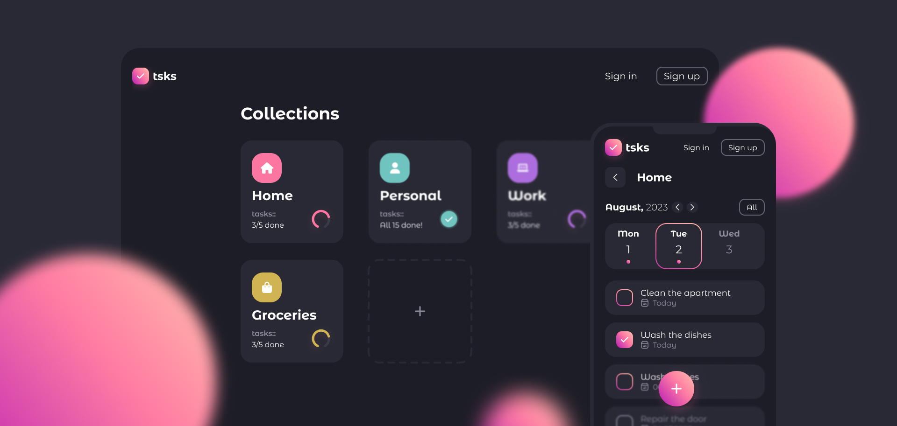

# TSKS - Fullstack Todo App
**TSKS** is a comprehensive **fullstack** todo application designed to empower users in efficiently managing their tasks and categories. Whether you're a seasoned user or just exploring, you have the flexibility to register for a personalized experience or simply try out our demo mode.

## Live Demo
:rocket: [**Live Demo**](https://tsks-app.onrender.com/)

## About Project

### Technologies Used
- React, Redux Toolkit, Redux Persist | LocalStorage
- TypeScript, JavaScript
- Node.js, Express.js
- MongoDB
- Axios, Interceptors
- CSS modules, SCSS
- React Swiper

### Features
* **Create** custom **categories** to organize tasks.
* **Personalize** categories with **icons**.
* Efficiently manage tasks, including **creation**, **updating**, and **deletion**.
* **Set deadlines** for tasks to stay organized.
* **Register** to unlock advanced features.
* Explore the app in **Demo Mode** without registration.
* Track task **completion progress**.
* **Quickly filter** tasks by category, deadline, or priority.

## Getting Started
Follow these detailed steps to get started with the TSKS Fullstack Todo App:

### Clone the Repository
First, clone the TSKS repository to your local machine using the following command:
```
git clone https://github.com/your-username/todo-app.git
cd todo-app
```
### Install Dependencies
Navigate to both the `frontend` and `backend` directories and install the necessary dependencies separately. Start with the frontend:

#### Frontend
```
cd frontend
npm install
```

#### Backend
```
cd ../backend
npm install
```
### Set up Your Database
To manage authentication and data, you'll need a MongoDB database. Follow these steps:

1. Visit the [MongoDB website](https://www.mongodb.com/) and sign up to create a MongoDB Atlas account or set up a local MongoDB instance.
2. Obtain your database connection details.

### Set up Environment Variables
#### Frontend
Create a `.env` file in the frontend root directory and add the following environment variables:
```
REACT_APP_API_URL=your_api_url
```
**Replace placeholders** with your actual configuration values.
#### Backend
Create a `.env` file in the backend root directory and add the following environment variables:
```
PORT=your_port
DB_USERNAME=your_db_username
DB_PASSWORD=your_db_password
DB_PORT=your_db_port
DB_HOST=your_db_host
DB_NAME=your_db_name
JWT_ACCESS_SECRET=your_access_secret_key
JWT_REFRESH_SECRET=your_refresh_secret_key
JWT_RESET_SECRET=your_reset_secret_key
SMTP_HOST=your_smtp_host
SMTP_PORT=your_smtp_port
SMTP_USER=your_smtp_user
SMTP_PASSWORD=your_smtp_password
SERVER_URL=http://localhost:your_backend_port
CLIENT_URL=http://localhost:your_frontend_port
```
**Replace placeholders** with your actual configuration values.

### Start the Backend Server
To run the backend server, execute the following command from the backend directory:
```
npm run dev
```

### Start the Frontend Server
To run the frontend server, execute the following command from the frontend directory:
```
npm start
```

### Open the App
Open your web browser and visit the following URL: [TSKS App](http://localhost:3000)

Now you're ready to use the TSKS app on your local development environment.

## Contributing
Contributions to the TSKS App are welcome! If you find any issues or have suggestions for improvements, feel free to open a new issue or submit a pull request.

## License
This project is licensed under the MIT License. Feel free to use, modify, and distribute the code for personal and commercial purposes.

## Contributors:
- :ukraine: [Oleksandr Antonenko](https://github.com/Oleksandr-Antonenko) – Frontend/Backend Developer | Designer
- :ukraine: [Serhii Vorobei](https://github.com/sergey-vorobei) – Frontend Developer
- :ukraine: [Maryna Kucher](https://github.com/mary-kucher) – Frontend Developer
